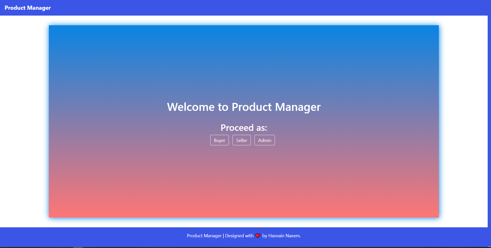

# Product Manager
 A responsive product managing website with admin, buyer and seller panels created using node.js (express) on server-side and jquery 
 on client-side. It was created whilst learning node.js (~15 hours spent and 5 cups of coffee were consumed).
 ### Implemented Features
- [x] Admin(s) can add, delete and view users.
- [x] Sellers can add, edit, delete and view products. 
- [x] Buyer can view the products.
- [x] Sessions are used to prevent access to admin, buyer and seller panels without logging in.
- [x] XSS and no-sql injections are considered (not thoroughly).
- [x] AJAX is used to communicate with the server-side to for dynamic experience.
- [x] Responsive and elegant design.
- [x] Appropriate feedback is provided to user in case of actions and errors on both client-side and server-side (through AJAX)
### Remaining Features
- [ ] Back-end support for product image uploading and path storage in database.
- [ ] Buy and review feature in buyer panel.
- [ ] Password Hashing

## Setup
    1.	Install all the node packages by running “node install” command.
    2.	Change the MongoDB server path and database name in file named 
            “database-settings.js” in directory “config”.
    3.	Run the server. That’s it.

## Database Collections
## Users 
Different collections are used because a person can be a seller and buyer at the same time.
#### Admin
 Username | Email | Password 
 ------------- | ------------- | ------
Required (Used for internal operations such as storing products)| Required (Used to login) | Required (Not hashed)
 
 #### Buyer
 Username | Email | Password 
 ------------- | ------------- | ------
Required (Used for internal operations such as storing products)| Required (Used to login) | Required (Not encrypted)
 
 #### Seller
 Username | Email | Password 
 ------------- | ------------- | ------
Required (Used for internal operations such as storing products)| Required (Used to login) | Required (Not encrypted)
 
### Product
 Name | Description | Price | Category | Seller | Review | ImagePath
 ------------- | ------------- | -----------| ------ | ---- | -----| ----|
Required  | Optional | Optional | Optional | Required | Optional | Optional

## Screenshots
### Home Page

### Login Page

### Admin Panel

### Seller Panel

### Buyer Panel

### Restricted Page

